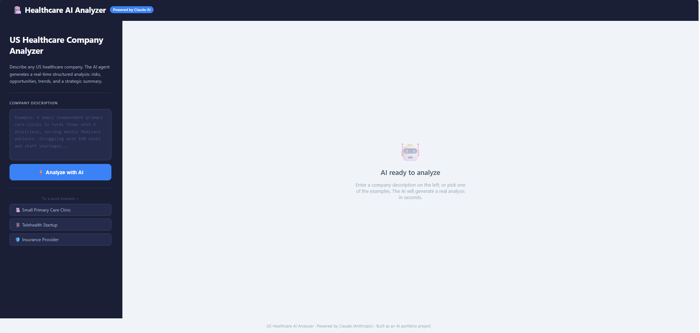
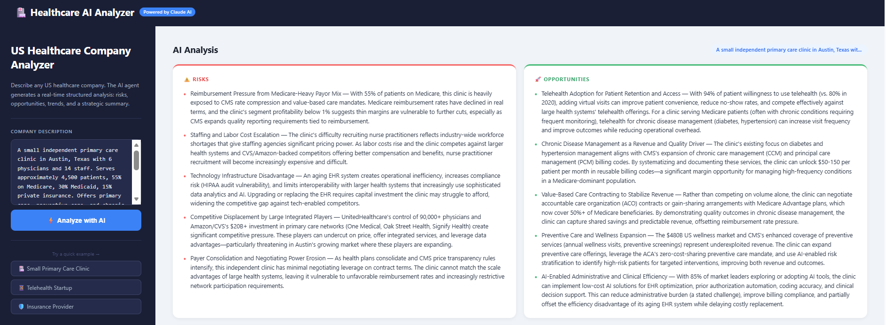
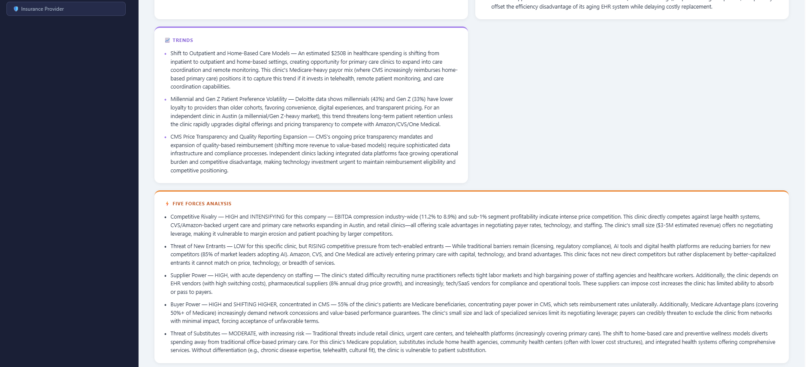
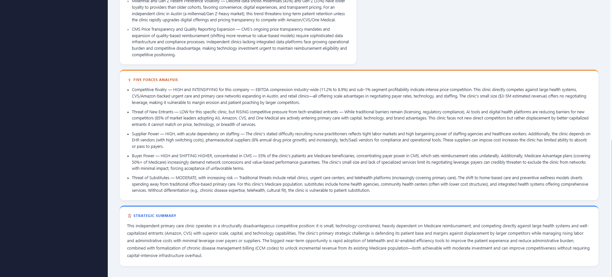

# 🏥 US Healthcare AI Analyzer

> An AI-powered web application that generates real-time strategic analysis of any US healthcare company using Claude AI (Anthropic).

**Live Demo:** https://us-healthcare-ai-analyzer-1.onrender.com
## Screenshots







---

## What It Does

Enter a description of any US healthcare company — clinic, telehealth startup, or insurance provider — and the AI agent instantly generates a structured strategic report:

- ⚠️ **Risks** — regulatory, financial, operational, and competitive threats
- 🚀 **Opportunities** — growth areas specific to the company's market position
- 📈 **Trends** — relevant US healthcare market trends (AI adoption, CMS changes, consumer behavior)
- ⚡ **Five Forces Analysis** — Porter's Five Forces tailored to the specific company
- 📋 **Strategic Summary** — executive-level synthesis of position, challenge, and opportunity

## Demo

| Input | Output |
|---|---|
| Describe a healthcare company | Get full AI-powered strategic analysis in seconds |

**Example companies included:**
- 🏥 Small Primary Care Clinic (Dallas, TX)
- 📱 Mental Health Telehealth Startup (22 states)
- 🛡️ Regional Insurance Provider (Southeast US)

---

## How It Works

```
User Input → Flask Server → Claude AI (Anthropic) → Structured Analysis → Web UI
```

1. User submits a company description via the web interface
2. Flask backend sends the description to Claude with a domain-specific prompt
3. Claude analyzes the company using real US healthcare market context (CMS, HIPAA, ACA, payer dynamics)
4. Response is parsed into structured sections and rendered as cards

---

## Tech Stack

| Layer | Technology |
|---|---|
| Frontend | HTML, CSS, JavaScript (vanilla) |
| Backend | Python, Flask |
| AI Engine | Claude (claude-haiku-4-5) via Anthropic API |
| Deployment | Render.com |

---

## Local Setup

**1. Clone the repository**
```bash
git clone https://github.com/katya-davydova/us-healthcare-ai-analyzer.git
cd us-healthcare-ai-analyzer
```

**2. Install dependencies**
```bash
pip install flask anthropic
```

**3. Set your API key**
```bash
# Windows
set ANTHROPIC_API_KEY=your_key_here

# Mac/Linux
export ANTHROPIC_API_KEY=your_key_here
```
Get your API key at [console.anthropic.com](https://console.anthropic.com)

**4. Run the server**
```bash
python server.py
```

**5. Open in browser**
```
http://localhost:5000
```

---

## Project Structure

```
├── server.py          # Flask backend + Claude API integration
├── analyzer.py        # Standalone CLI version
├── index.html         # Frontend UI
└── requirements.txt   # Python dependencies
```

---

## Domain Knowledge Built In

The AI prompt is enriched with real US healthcare market data:

- EBITDA compression trends (11.2% → 8.9% 2019–2024)
- CMS price transparency rules impact
- Workforce shortage dynamics
- Millennial/Gen Z patient loyalty data (Deloitte 2024)
- Tech giant acquisitions: Amazon/CVS $20B+ in One Medical, Oak Street Health
- Drug pricing trends ($990B projected by 2029)

---

## Why This Project

Built as a portfolio project demonstrating:
- **AI integration** — practical use of LLM APIs for structured business analysis
- **Domain expertise** — US healthcare market knowledge embedded in prompt engineering
- **Full-stack development** — end-to-end web application from backend to deployed UI
- **Real business value** — tool that solves an actual analytical use case

---

## Author

**Ekaterina Davydova**  
M.S. Information Systems & Technologies — University of North Texas  
[LinkedIn](https://linkedin.com/in/ekaterina-davydova-20891b367)

---

*Powered by Claude (Anthropic) · Deployed on Render*
